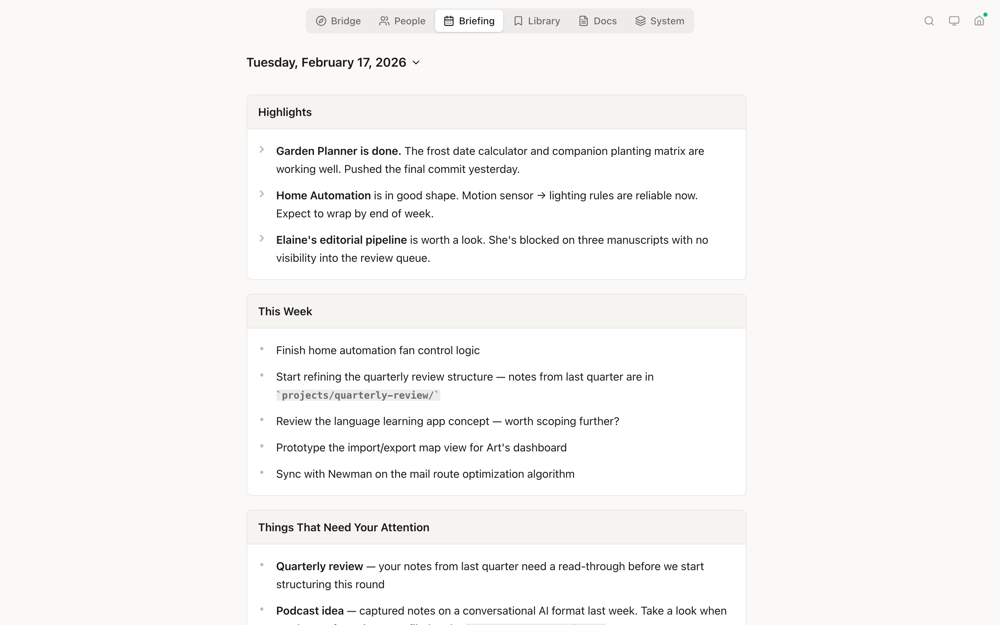
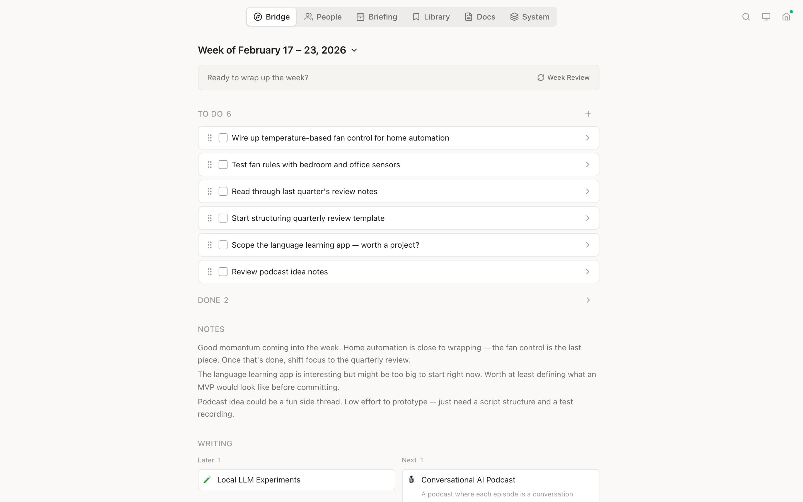
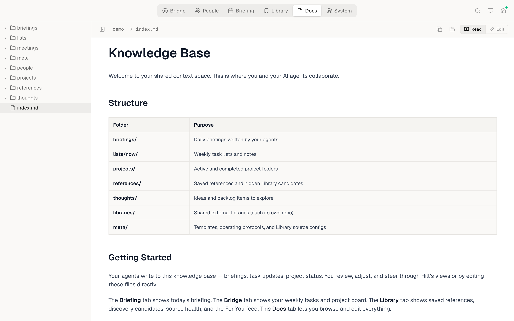
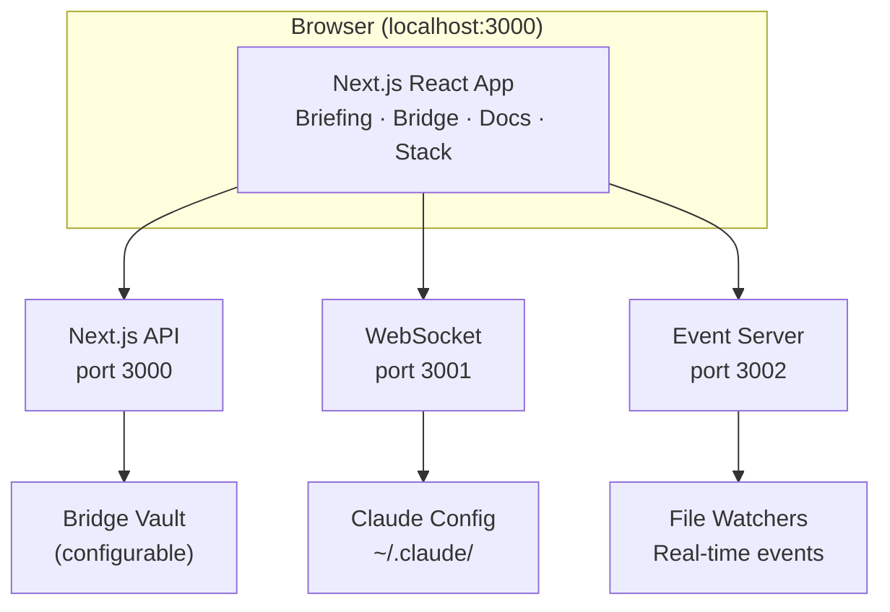

# 🗡️ Hilt

A shared context space for you and your AI agents. A handle by which to wield AI for good.

Hilt is a viewer and light editor built on top of the file system — the common interface where humans and agents already meet. It doesn't have its own chat. You talk to your agents wherever you already do: Claude Code, Codex, OpenClaw, or whatever you use. Hilt gives both of you a structured window into the same knowledge base, tasks, briefings, and configuration — so your agents can keep you updated, calibrate their work with you, surface things that need your attention, and help you track your own priorities.

It's designed to be used by agents as much as by humans. Your agents write briefings, manage tasks, and update project status. You read, review, adjust, and steer. Hilt is where that loop becomes visible.

**A note on agent protocols:** Hilt defines the folder structure and file formats, but the instructions that tell your agents *how* to generate content — when to write a briefing, how to break down a project, what to put in a weekly list — currently live outside of Hilt, in each agent's own configuration (CLAUDE.md files, system prompts, custom skills, etc.). Over time, we'd like to bake the common protocols into Hilt itself. For now, there's some trial and error getting agents to produce well-structured output for a new setup. The `meta/` folder is a start — you can put templates and protocol documents there for your agents to reference.

## Views

Hilt provides four views via the top navigation:

| View | Purpose |
|------|---------|
| **Briefing** | Daily briefings written by your agents — status updates, summaries, things that need your attention |
| **Bridge** | Weekly tasks, project tracking, and notes — shared between you and your agents |
| **Docs** | Browse and edit the markdown and code files in your knowledge base |
| **Stack** | Inspect and edit Claude's configuration hierarchy (CLAUDE.md, MCP servers, plugins, skills) |

## Features

### Briefing View



Daily briefings generated by your agents:

- **Date Selector** — Browse past briefings with a dropdown date picker
- **Markdown Rendering** — Full GFM support (tables, code blocks, lists)
- **Unread Indicator** — Blue dot on the tab when new briefings are available
- **Read State Tracking** — Persisted across sessions so you know what's new

### Bridge View



Weekly planning and project management:

- **Task List** — Drag-and-drop task ordering with checkboxes and inline title editing
- **Project Board** — Track projects across columns (considering, refining, doing) with status management
- **Project Linking** — Link tasks to project folders; click project cards to open in Docs
- **Weekly Notes** — Rich text notes with inline images, tables, and task lists (TipTap editor)
- **File Uploads** — Drop or paste images, videos, and files directly into editors
- **Search Filtering** — Filter tasks and projects by title, tags, and content
- **Real-Time Updates** — WebSocket-driven file watching for instant UI updates

### Docs View



Browse and edit your project's markdown documentation:

- **Collapsible Sidebar** — Resizable file tree that slides away for more reading space; mobile-friendly drawer overlay
- **Markdown Editor** — MDXEditor with toolbar, syntax highlighting, and live preview
- **Code Viewer** — View 30+ file types with CodeMirror syntax highlighting and edit support
- **Wikilinks** — Obsidian-style `[[links]]` with vault-relative resolution and cross-scope navigation
- **Rich Content** — Render images, PDFs, CSVs, and Mermaid diagrams inline
- **Code Block Copy** — Hover copy-to-clipboard button on code blocks in read mode
- **Per-Folder Sorting** — Toggle between A-Z and "sort by recent" per folder
- **URL Document Selection** — `?doc=path` query param for deep linking to files

### Stack View

Inspect and edit Claude's configuration across all four layers:

- **Unified Layer Browser** — All layers (System, User, Project, Local) in one resizable sidebar
- **Config Files** — Browse CLAUDE.md, settings.json, hooks, commands, skills, and agents
- **MCP Servers** — View server details, connection type, env vars, and OAuth auth status
- **Plugins** — Collapsible plugin containers with nested MCP servers, skills, and agents; enable/disable toggle
- **Inline Editing** — Edit markdown and JSON configuration files directly
- **Search & Filter** — Filter by name or type (MCP, plugins, skills, agents)

### Navigation & Filtering

- **Breadcrumb Nav** — Click path segments to navigate project hierarchy
- **Pinned Folders** — Pin folders to the sidebar with custom emoji icons
- **Global Search** — Filter content across all views (tasks, files, configs)
- **URL-Based Routing** — View and scope encoded in URL path for bookmarking and browser history
- **Add Task Button** — "+" in toolbar to create Bridge tasks from anywhere

### Native Desktop App

- **Electron Wrapper** — Run as a native macOS application with self-contained dev servers
- **Back/Forward Navigation** — Cmd+[/] and trackpad swipe for history navigation
- **DMG Installer** — Easy installation via drag-and-drop

## Getting Started

### Prerequisites

- **Node.js 18.18+** — [Download](https://nodejs.org/) or use [nvm](https://github.com/nvm-sh/nvm)
- **Claude Code CLI** — The `claude` command should be available

### Installation

```bash
git clone https://github.com/jruck/hilt.git
cd hilt
npm install
```

### Configuration

Copy the example environment file and fill in your values:

```bash
cp .env.example .env
```

Edit `.env` with your settings:

| Variable | Required | Description |
|----------|----------|-------------|
| `HILT_WORKING_FOLDER` | Yes | Your working folder — the top-level directory where your knowledge base, code, and other important context live downstream (e.g., `~/work` or `~/projects`). Not your home folder. |
| `BRIDGE_VAULT_PATH` | No | Path to your knowledge base (weekly tasks, projects, notes). Only needed if it lives outside your working folder. Defaults to `HILT_WORKING_FOLDER`. |
| `NEXT_PUBLIC_REMOTE_HOST` | No | Hostname for remote access (e.g., a Tailscale machine name). When set, Hilt shows a local/remote switcher. |

### Folder Structure

Hilt reads from a known folder structure inside your working folder (or `BRIDGE_VAULT_PATH` if set separately). You can create these yourself, or let your agents create them as they produce output.

```
your-working-folder/
├── briefings/                 ← Briefing view: daily markdown files
│   └── 2026-02-17.md          (one per day, YYYY-MM-DD.md)
├── lists/
│   └── now/                   ← Bridge view: weekly task lists
│       └── 2026-02-17.md      (one per week, YYYY-MM-DD.md)
├── projects/                  ← Bridge view: project folders
│   └── my-project/
│       └── index.md           (frontmatter: status, area, tags)
├── thoughts/                  ← Bridge view: ideas and backlog
│   └── some-idea/
│       └── index.md           (frontmatter: status, icon, created)
├── libraries/                 ← Shared libraries (each its own git repo)
│   └── my-library/
│       ├── projects/
│       │   └── sub-project/
│       │       └── index.md
│       └── ...                (library's own structure)
└── meta/                      ← Templates and operating protocols
    └── templates/
        └── weekly-list.md
```

Most folders are optional — if they don't exist, the corresponding view section is simply empty. The Docs view browses any folder you point it at; it has no fixed structure requirements.

**Briefings** (`briefings/YYYY-MM-DD.md`) are markdown files with optional YAML frontmatter (`title`, `summary`). Your agents write these to keep you updated.

**Weekly lists** (`lists/now/YYYY-MM-DD.md`) contain `## Tasks` and `## Notes` sections with checkbox task items. Hilt reads the most recent file.

**Projects** (`projects/*/index.md`) use frontmatter to track status (`considering`, `refining`, `doing`, `done`), which maps to columns on the project board.

**Thoughts** (`thoughts/*/index.md`) use frontmatter status (`next`, `later`) for prioritization.

**Libraries** (`libraries/`) are for external, shared libraries. Your working folder is your personal knowledge base, but libraries are where you store other libraries you use or share with other people. Each library inside this folder should be its own git repository — the `libraries/` folder itself is gitignored so its contents don't get committed to your personal knowledge base. Each library is shared with whoever is appropriate for that library's scope. Hilt's views (Briefing, Bridge, Docs) look across both your personal folders and all libraries, so you get a unified view of your own work and everything you're collaborating on.

**Meta** (`meta/`) holds templates and operating protocols — instructions for how Hilt and your AI agents should generate content. The `meta/templates/weekly-list.md` template defines the structure for new weekly task lists. You can add other templates and protocol documents here that your agents reference when producing briefings, project updates, or other structured output.

### Try It with Demo Content

The repo includes a `demo/` folder with sample briefings, a weekly task list, projects, and thoughts. If you want to see how Hilt works before creating your own knowledge base, point your `.env` at it:

```bash
HILT_WORKING_FOLDER=./demo
```

This is the same content shown in the screenshots above.

### Running the App

The best way to use Hilt is through the Electron app in dev mode. It runs as a native macOS window with live reloading, so you see changes from your agents in real time — and changes you make to the app itself:

```bash
npm run electron:dev
```

You can also run it in the browser if you prefer:

```bash
npm run dev:all
```
Open [http://localhost:3000](http://localhost:3000) in your browser.

A compiled Electron build (`npm run electron:build`) exists for wider distribution but isn't necessary for day-to-day use.

## Documentation

Detailed documentation is available in the [`docs/`](docs/) folder:

| Document | Description |
|----------|-------------|
| [Architecture](docs/ARCHITECTURE.md) | System design, data flow diagrams, constraints |
| [API Reference](docs/API.md) | All REST endpoints and WebSocket protocol |
| [Data Models](docs/DATA-MODELS.md) | TypeScript interfaces and storage formats |
| [Components](docs/COMPONENTS.md) | React component hierarchy and props |
| [Development](docs/DEVELOPMENT.md) | Setup, debugging, common patterns |
| [Design Philosophy](docs/DESIGN-PHILOSOPHY.md) | UI/UX preferences and patterns |
| [Changelog](docs/CHANGELOG.md) | Version history with technical notes |

## Architecture



## Tech Stack

| Layer | Technology | Purpose |
|-------|------------|---------|
| Framework | Next.js 16 + React 19 | UI and API routes |
| Language | TypeScript 5 | Type safety |
| Styling | Tailwind CSS 4 | Utility-first CSS |
| Drag & Drop | dnd-kit | Task and folder reordering |
| Bridge Editor | TipTap | Rich text editing for tasks and notes |
| Docs Editor | MDXEditor + CodeMirror | Markdown and code file editing |
| Data Fetching | SWR | Server state with WebSocket-driven updates |
| WebSocket | ws | Real-time file change events |
| Validation | Zod | Schema validation |

## Scripts

| Command | Description |
|---------|-------------|
| `npm run dev:all` | **Start development** (Next.js + WebSocket + Event servers) |
| `npm run build` | Production build |
| `npm run lint` | Run ESLint |
| `npm run electron:dev` | Start Electron app in dev mode |
| `npm run electron:build` | Build native macOS app |

## Contributing

Before making changes:
1. Read [docs/ARCHITECTURE.md](docs/ARCHITECTURE.md) for system context
2. Check [docs/CHANGELOG.md](docs/CHANGELOG.md) for recent changes
3. **For UI work**: Read [docs/DESIGN-PHILOSOPHY.md](docs/DESIGN-PHILOSOPHY.md) for design preferences

After completing work:
1. Update [docs/CHANGELOG.md](docs/CHANGELOG.md) under `[Unreleased]`
2. Update relevant docs if architecture/API/types changed

## License

MIT
