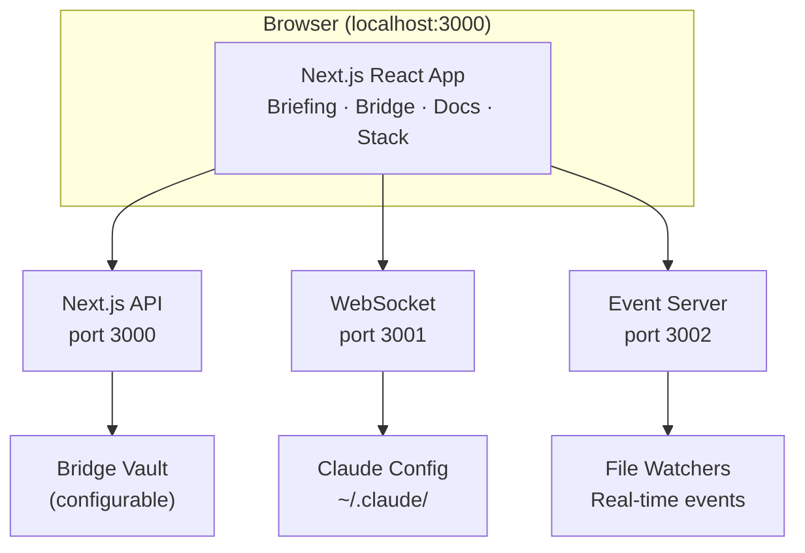

# 🗡️ Hilt

A shared context space for you and your AI agents. A handle by which to wield AI for good.

Hilt is a viewer and light editor built on top of the file system — the common interface where humans and agents already meet. It doesn't have its own chat. You talk to your agents wherever you already do: Claude Code, Codex, OpenClaw, or whatever you use. Hilt gives both of you a structured window into the same knowledge base, tasks, briefings, and configuration — so your agents can keep you updated, calibrate their work with you, surface things that need your attention, and help you track your own priorities.

It's designed to be used by agents as much as by humans. Your agents write briefings, manage tasks, and update project status. You read, review, adjust, and steer. Hilt is where that loop becomes visible.

## Contents

- [Views](#views) — Briefing, Bridge, Docs, Stack
- [Getting Started](#getting-started) — Install, configure, run
- [Folder Structure](#folder-structure) — How your knowledge base is organized
- [Architecture](#architecture) — System design and tech stack
- [Contributing](#contributing) — Guidelines and detailed docs

## Views

### Briefing


Daily briefings generated by your agents. Date selector for browsing past briefings, full GFM markdown rendering, unread indicator (blue dot on the tab), and read state tracking persisted across sessions.

### Bridge


Weekly planning and project management. Drag-and-drop task ordering with checkboxes and inline editing. Project board with status columns (considering, refining, doing). Rich text notes with inline images, tables, and file uploads (TipTap editor). Tasks can link to project folders. Real-time updates via WebSocket file watching.

### Docs


Browse and edit markdown and code files in your knowledge base. Collapsible, resizable sidebar with file tree. MDXEditor for markdown, CodeMirror for 30+ code file types. Obsidian-style `[[wikilinks]]` with vault-relative resolution. Renders images, PDFs, CSVs, and Mermaid diagrams inline. Code block copy button on hover. Per-folder sorting (A-Z or recent). Deep linking via `?doc=path`.

### Stack

Inspect and edit Claude's configuration across all four layers (System, User, Project, Local). Browse CLAUDE.md files, settings, hooks, commands, skills, agents, MCP servers, and plugins. Inline editing for markdown and JSON. Search and filter by name or type.

### Navigation

Breadcrumb nav for folder hierarchy. Pinned folders with custom emoji icons. Global search across all views. URL-based routing for bookmarking and browser history. "+" button to create Bridge tasks from anywhere.

### Desktop App

Native macOS app via Electron with back/forward navigation (Cmd+[/] and trackpad swipe). DMG installer for easy distribution.

### CLI Navigation

Any Claude session (or script) can tell the running Hilt app to navigate to a specific file, person, or view:

```bash
PORT=$(cat ~/.hilt-ws-port)

# Open a file in Docs view
curl -s -X POST "http://localhost:$PORT/navigate" \
  -H "Content-Type: application/json" \
  -d '{"view":"docs","path":"/Users/me/work/bridge/meetings/2026-03-04/standup.md"}'

# Focus on a person
curl -s -X POST "http://localhost:$PORT/navigate" \
  -H "Content-Type: application/json" \
  -d '{"view":"people","path":"/amrit"}'

# Switch to Bridge view
curl -s -X POST "http://localhost:$PORT/navigate" \
  -d '{"view":"bridge"}'
```

Views: `bridge`, `docs`, `stack`, `briefings`, `people`. The `path` field is optional — omit it to just switch views. `docs` and `stack` use absolute file paths; `people` uses slug paths (e.g., `/amrit`). In Electron, the window auto-focuses.

A `/hilt` skill is included at `.claude/skills/hilt/` — symlink it to `~/.claude/skills/hilt` to make it available globally. Then any Claude session can respond to "show me my last meeting" or "pull up Amrit" by discovering the right file and navigating Hilt to it.

## Getting Started

**Prerequisites:** Node.js 18.18+ ([download](https://nodejs.org/) or use [nvm](https://github.com/nvm-sh/nvm)) and the [Claude Code CLI](https://docs.anthropic.com/en/docs/claude-code).

### Install

```bash
git clone https://github.com/jruck/hilt.git
cd hilt
npm install
```

### Configure

```bash
cp .env.example .env
```

Edit `.env` with your settings:

| Variable | Required | Description |
|----------|----------|-------------|
| `HILT_WORKING_FOLDER` | Yes | Your working folder — the top-level directory where your knowledge base, code, and other important context live downstream (e.g., `~/work` or `~/projects`). Not your home folder. |
| `BRIDGE_VAULT_PATH` | No | Path to your knowledge base (weekly tasks, projects, notes). Only needed if it lives outside your working folder. Defaults to `HILT_WORKING_FOLDER`. |
| `NEXT_PUBLIC_REMOTE_HOST` | No | Hostname for remote access (e.g., a Tailscale machine name). When set, Hilt shows a local/remote switcher. |

> [!TIP]
> **Want to try it first?** Set `HILT_WORKING_FOLDER=./docs/demo` to explore Hilt with sample briefings, tasks, projects, and thoughts — no setup needed. This is the same content shown in the screenshots above.

### Run

The best way to use Hilt is through the Electron app in dev mode. It runs as a native macOS window with live reloading, so you see changes from your agents in real time — and changes you make to the app itself:

```bash
npm run electron:dev
```

You can also run it in the browser:

```bash
npm run dev:all
```

Open [http://localhost:3000](http://localhost:3000). A compiled Electron build (`npm run electron:build`) exists for wider distribution but isn't necessary for day-to-day use.

## Folder Structure

Hilt reads from a known folder structure inside your working folder (or `BRIDGE_VAULT_PATH` if set separately). You can create these yourself, or let your agents create them as they produce output.

```
your-working-folder/
├── briefings/                 ← Briefing view: daily markdown files
│   └── 2026-02-17.md          (one per day, YYYY-MM-DD.md)
├── lists/
│   └── now/                   ← Bridge view: weekly task lists
│       └── 2026-02-17.md      (one per week, YYYY-MM-DD.md)
├── projects/                  ← Bridge view: project folders
│   └── my-project/
│       └── index.md           (frontmatter: status, area, tags)
├── thoughts/                  ← Bridge view: ideas and backlog
│   └── some-idea/
│       └── index.md           (frontmatter: status, icon, created)
├── libraries/                 ← Shared libraries (each its own git repo)
│   └── my-library/
│       ├── projects/
│       │   └── sub-project/
│       │       └── index.md
│       └── ...                (library's own structure)
└── meta/                      ← Templates and operating protocols
    └── templates/
        └── weekly-list.md
```

Most folders are optional — if they don't exist, the corresponding view section is simply empty. The Docs view browses any folder you point it at; it has no fixed structure requirements.

**Briefings** (`briefings/YYYY-MM-DD.md`) are markdown files with optional YAML frontmatter (`title`, `summary`). Your agents write these to keep you updated.

**Weekly lists** (`lists/now/YYYY-MM-DD.md`) contain `## Tasks` and `## Notes` sections with checkbox task items. Hilt reads the most recent file.

**Projects** (`projects/*/index.md`) use frontmatter to track status (`considering`, `refining`, `doing`, `done`), which maps to columns on the project board.

**Thoughts** (`thoughts/*/index.md`) use frontmatter status (`next`, `later`) for prioritization.

**Libraries** (`libraries/`) are for external, shared libraries. Each library should be its own git repository — the `libraries/` folder itself is gitignored so its contents don't get committed to your personal knowledge base. Each library is shared with whoever is appropriate for that library's scope. Hilt's views look across both your personal folders and all libraries, so you get a unified view.

**Meta** (`meta/`) holds templates and operating protocols for how your agents generate content. The `meta/templates/weekly-list.md` template defines the structure for new weekly task lists. You can add other templates and protocol documents here for your agents to reference.

> **A note on agent protocols:** Hilt defines the folder structure and file formats, but the instructions that tell your agents *how* to generate content — when to write a briefing, how to break down a project, what to put in a weekly list — currently live outside of Hilt, in each agent's own configuration (CLAUDE.md files, system prompts, custom skills, etc.). Over time, we'd like to bake the common protocols into Hilt itself. The `meta/` folder is a starting point.

## Architecture



### Tech Stack

| Layer | Technology | Purpose |
|-------|------------|---------|
| Framework | Next.js 16 + React 19 | UI and API routes |
| Language | TypeScript 5 | Type safety |
| Styling | Tailwind CSS 4 | Utility-first CSS |
| Drag & Drop | dnd-kit | Task and folder reordering |
| Bridge Editor | TipTap | Rich text editing for tasks and notes |
| Docs Editor | MDXEditor + CodeMirror | Markdown and code file editing |
| Data Fetching | SWR | Server state with WebSocket-driven updates |
| WebSocket | ws | Real-time file change events |
| Validation | Zod | Schema validation |

### Scripts

| Command | Description |
|---------|-------------|
| `npm run dev:all` | Start development (Next.js + WebSocket + Event servers) |
| `npm run build` | Production build |
| `npm run lint` | Run ESLint |
| `npm run electron:dev` | Start Electron app in dev mode |
| `npm run electron:build` | Build native macOS app |

## Contributing

Before making changes:
1. Read [docs/ARCHITECTURE.md](docs/ARCHITECTURE.md) for system context
2. Check [docs/CHANGELOG.md](docs/CHANGELOG.md) for recent changes
3. **For UI work**: Read [docs/DESIGN-PHILOSOPHY.md](docs/DESIGN-PHILOSOPHY.md) for design preferences

After completing work:
1. Update [docs/CHANGELOG.md](docs/CHANGELOG.md) under `[Unreleased]`
2. Update relevant docs if architecture/API/types changed

Detailed documentation in [`docs/`](docs/): [Architecture](docs/ARCHITECTURE.md) · [API](docs/API.md) · [Data Models](docs/DATA-MODELS.md) · [Components](docs/COMPONENTS.md) · [Development](docs/DEVELOPMENT.md) · [Design Philosophy](docs/DESIGN-PHILOSOPHY.md) · [Changelog](docs/CHANGELOG.md)

## License

MIT
