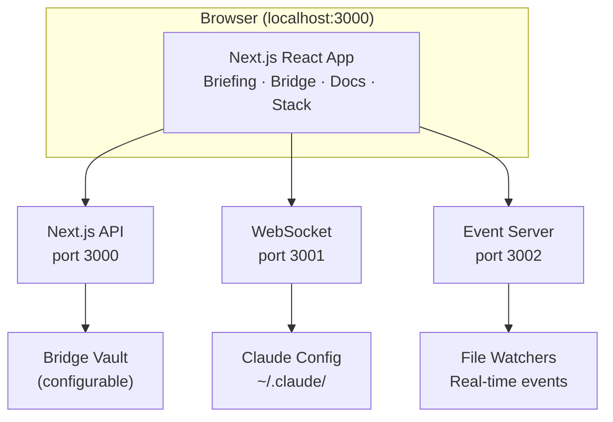

# 🗡️ Hilt

A project dashboard with daily briefings, weekly task management, a markdown docs viewer, and a Claude configuration inspector.

## Core Concepts

Hilt provides three primary views via the top navigation, plus a settings panel:

| View | Purpose |
|------|---------|
| **Briefing** | Daily briefings generated by your agents |
| **Bridge** | Weekly task management, project tracking, and notes |
| **Docs** | Browse and edit markdown files in your project |
| **Stack** | Inspect Claude's configuration hierarchy (accessed via toolbar icon) |

## Features

### Briefing View

Daily briefings generated by your agents:

- **Date Selector** — Browse past briefings with a dropdown date picker
- **Markdown Rendering** — Full GFM support (tables, code blocks, lists)
- **Unread Indicator** — Blue dot on the tab when new briefings are available
- **Read State Tracking** — Persisted across sessions so you know what's new

### Bridge View

Weekly planning and project management:

- **Task List** — Drag-and-drop task ordering with checkboxes and inline title editing
- **Project Board** — Track projects across columns (considering, refining, doing) with status management
- **Project Linking** — Link tasks to project folders; click project cards to open in Docs
- **Weekly Notes** — Rich text notes with inline images, tables, and task lists (TipTap editor)
- **File Uploads** — Drop or paste images, videos, and files directly into editors
- **Search Filtering** — Filter tasks and projects by title, tags, and content
- **Real-Time Updates** — WebSocket-driven file watching for instant UI updates

### Docs View

Browse and edit your project's markdown documentation:

- **Collapsible Sidebar** — Resizable file tree that slides away for more reading space; mobile-friendly drawer overlay
- **Markdown Editor** — MDXEditor with toolbar, syntax highlighting, and live preview
- **Code Viewer** — View 30+ file types with CodeMirror syntax highlighting and edit support
- **Wikilinks** — Obsidian-style `[[links]]` with vault-relative resolution and cross-scope navigation
- **Rich Content** — Render images, PDFs, CSVs, and Mermaid diagrams inline
- **Code Block Copy** — Hover copy-to-clipboard button on code blocks in read mode
- **Per-Folder Sorting** — Toggle between A-Z and "sort by recent" per folder
- **URL Document Selection** — `?doc=path` query param for deep linking to files

### Stack View

Inspect and edit Claude's configuration across all four layers:

- **Unified Layer Browser** — All layers (System, User, Project, Local) in one resizable sidebar
- **Config Files** — Browse CLAUDE.md, settings.json, hooks, commands, skills, and agents
- **MCP Servers** — View server details, connection type, env vars, and OAuth auth status
- **Plugins** — Collapsible plugin containers with nested MCP servers, skills, and agents; enable/disable toggle
- **Inline Editing** — Edit markdown and JSON configuration files directly
- **Search & Filter** — Filter by name or type (MCP, plugins, skills, agents)

### Navigation & Filtering

- **Breadcrumb Nav** — Click path segments to navigate project hierarchy
- **Pinned Folders** — Pin folders to the sidebar with custom emoji icons
- **Global Search** — Filter content across all views (tasks, files, configs)
- **URL-Based Routing** — View and scope encoded in URL path for bookmarking and browser history
- **Add Task Button** — "+" in toolbar to create Bridge tasks from anywhere

### Native Desktop App

- **Electron Wrapper** — Run as a native macOS application with self-contained dev servers
- **Back/Forward Navigation** — Cmd+[/] and trackpad swipe for history navigation
- **DMG Installer** — Easy installation via drag-and-drop

## Getting Started

### Prerequisites

- **Node.js 18.18+** — [Download](https://nodejs.org/) or use [nvm](https://github.com/nvm-sh/nvm)
- **Claude Code CLI** — The `claude` command should be available

### Installation

```bash
git clone https://github.com/jruck/hilt.git
cd hilt
npm install
```

### Configuration

Copy the example environment file and fill in your values:

```bash
cp .env.example .env
```

Edit `.env` with your settings:

| Variable | Required | Description |
|----------|----------|-------------|
| `HILT_WORKING_FOLDER` | Yes | Root folder where your knowledge base, working code, and other important context live downstream (e.g., `~/work` or `~/projects`). Not your home folder. |
| `BRIDGE_VAULT_PATH` | No | Path to your knowledge base (weekly tasks, projects, notes). Defaults to `HILT_WORKING_FOLDER`. |
| `NEXT_PUBLIC_REMOTE_HOST` | No | Hostname for remote access (e.g., a Tailscale machine name). When set, Hilt shows a local/remote switcher. |

### Running the App

**Browser Mode:**
```bash
npm run dev:all
```
Open [http://localhost:3000](http://localhost:3000) in your browser.

**Native macOS App:**
```bash
npm run electron:dev
```

**Build for Distribution:**
```bash
npm run electron:build
```

## Documentation

Detailed documentation is available in the [`docs/`](docs/) folder:

| Document | Description |
|----------|-------------|
| [Architecture](docs/ARCHITECTURE.md) | System design, data flow diagrams, constraints |
| [API Reference](docs/API.md) | All REST endpoints and WebSocket protocol |
| [Data Models](docs/DATA-MODELS.md) | TypeScript interfaces and storage formats |
| [Components](docs/COMPONENTS.md) | React component hierarchy and props |
| [Development](docs/DEVELOPMENT.md) | Setup, debugging, common patterns |
| [Design Philosophy](docs/DESIGN-PHILOSOPHY.md) | UI/UX preferences and patterns |
| [Changelog](docs/CHANGELOG.md) | Version history with technical notes |

## Architecture



## Tech Stack

| Layer | Technology | Purpose |
|-------|------------|---------|
| Framework | Next.js 16 + React 19 | UI and API routes |
| Language | TypeScript 5 | Type safety |
| Styling | Tailwind CSS 4 | Utility-first CSS |
| Drag & Drop | dnd-kit | Task and folder reordering |
| Bridge Editor | TipTap | Rich text editing for tasks and notes |
| Docs Editor | MDXEditor + CodeMirror | Markdown and code file editing |
| Data Fetching | SWR | Server state with WebSocket-driven updates |
| WebSocket | ws | Real-time file change events |
| Validation | Zod | Schema validation |

## Scripts

| Command | Description |
|---------|-------------|
| `npm run dev:all` | **Start development** (Next.js + WebSocket + Event servers) |
| `npm run build` | Production build |
| `npm run lint` | Run ESLint |
| `npm run electron:dev` | Start Electron app in dev mode |
| `npm run electron:build` | Build native macOS app |

## Contributing

Before making changes:
1. Read [docs/ARCHITECTURE.md](docs/ARCHITECTURE.md) for system context
2. Check [docs/CHANGELOG.md](docs/CHANGELOG.md) for recent changes
3. **For UI work**: Read [docs/DESIGN-PHILOSOPHY.md](docs/DESIGN-PHILOSOPHY.md) for design preferences

After completing work:
1. Update [docs/CHANGELOG.md](docs/CHANGELOG.md) under `[Unreleased]`
2. Update relevant docs if architecture/API/types changed

## License

MIT
