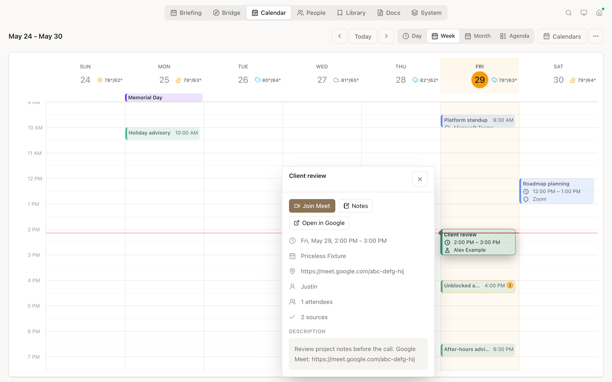
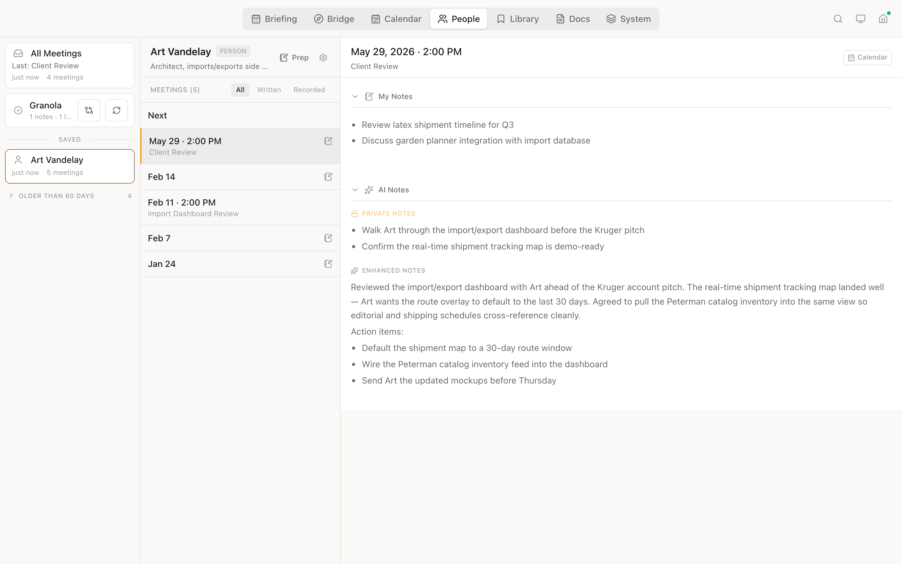
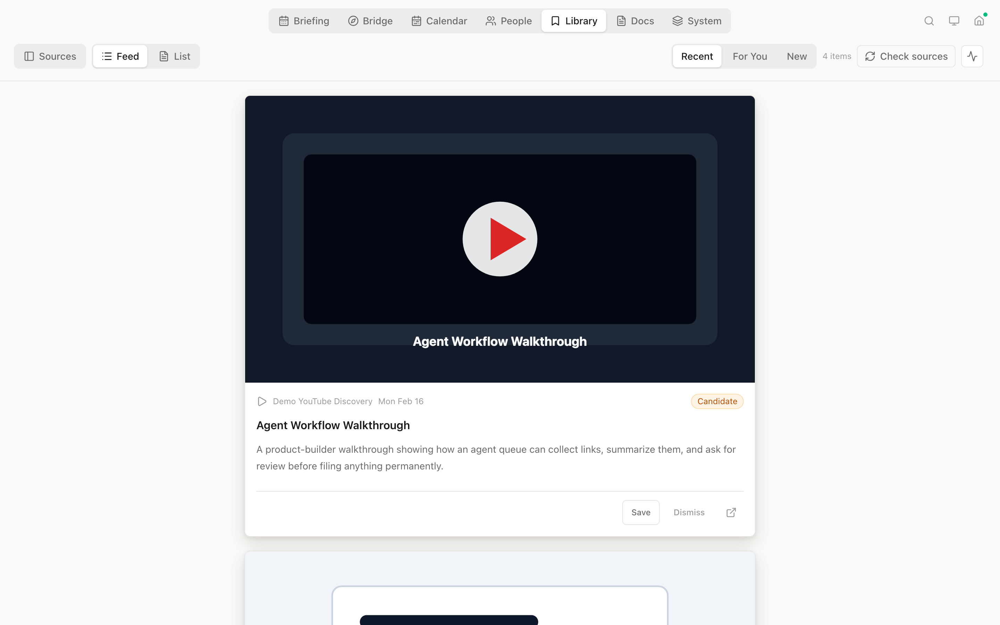
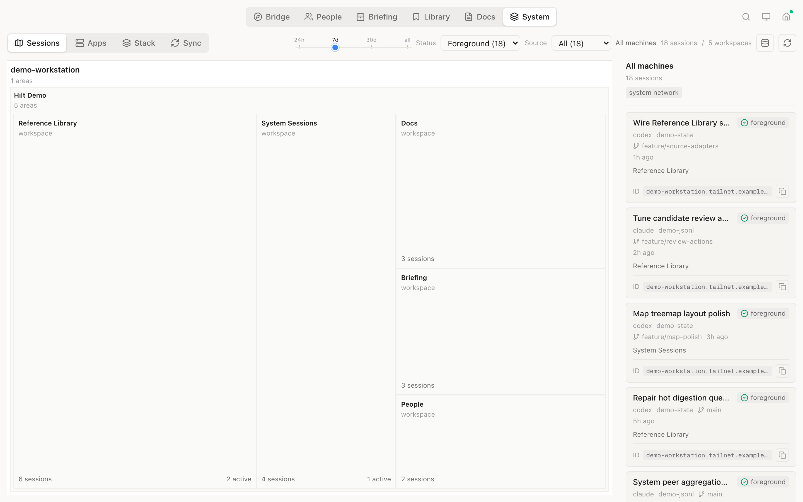
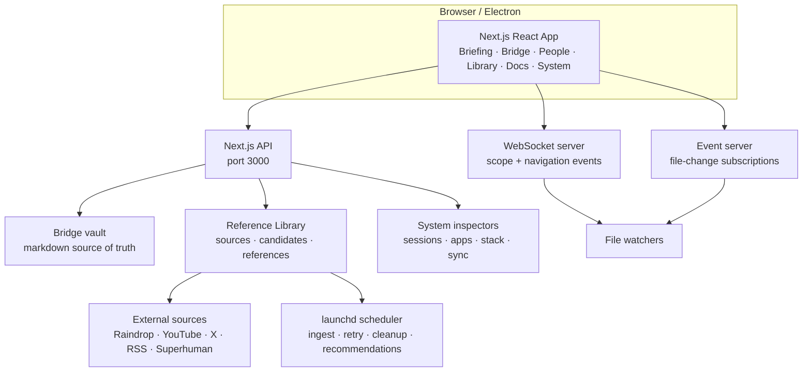

# Hilt

A shared context space for you and your AI agents. A handle by which to wield AI for good.

Hilt is a viewer and light editor built on top of the file system: the common surface where humans and agents already meet. It does not have its own chat. You keep talking to agents in Claude Code, Codex, OpenClaw, or whatever tool you prefer. Hilt gives both of you a structured window into the same knowledge base, tasks, briefings, references, people, documents, and system state.

Agents can write briefings, file references, update project status, and keep source pipelines moving. You can read, review, adjust, save, skip, archive, and steer. Hilt is where that loop becomes visible.

## Contents

- [Views](#views) — Briefing, Bridge, Calendar, People, Library, Docs, and System
- [Getting Started](#getting-started) — Install, configure, run
- [Folder Structure](#folder-structure) — How the file-native workspace is organized
- [Reference Library](#reference-library) — Ingestion, candidates, saved references, and source health
- [Architecture](#architecture) — System design and tech stack
- [Contributing](#contributing) — Guidelines and detailed docs

## Views

### Briefing


Daily briefings generated by agents. Browse past briefings, track read state, render full GFM markdown, and use the Briefing tab as the synthesized output surface for what changed across work, knowledge, people, and systems.

### Bridge


Weekly planning and project management. Bridge reads markdown weekly lists, task notes, and project folders from your vault. It supports checkbox tasks, project boards, inline notes, due-date badges, real-time file watching, and direct navigation into project docs.

### Calendar



A unified, read-only calendar over your ICS feeds. Hilt syncs work and personal calendars locally, de-duplicates the same event across feeds, and renders day/week/month/agenda views with per-day weather, a current-time indicator, and subtle availability hints for blocked work time. Each event collects its actions in one place — join links (Teams/Meet/Zoom), the source calendar, and any matched meeting notes — and the notes link back to the event in return.

### People



Contact directory and meeting memory. People combines person files, group notes, inline dated notes, and recorded meeting files into a timeline. It shows upcoming conversation prep, recurring meetings, matched transcripts, suggested people/groups, and meeting detail without hiding the underlying markdown.

### Library



File-native reference ingestion and review. The Library has a Feed for Recent and For You, plus a dense Browse view for source-level triage.

It distinguishes durable saved references from temporary candidates, renders markdown summaries instead of raw markup, embeds media, keeps cached source/transcripts available, supports Save/Skip/Archive actions, and exposes scheduler/source health from the header.

### Docs


Browse and edit markdown, code, media, CSVs, PDFs, and diagrams. Docs uses a plain markdown source editor for byte-exact round trips and a ReactMarkdown read view with wikilinks, images, Mermaid, tables, syntax highlighting, and Obsidian-style attachment handling.

### System



Operational inspection for the machine and agent environment. System contains Sessions, Apps, Stack, and Sync modes. It can show local/tailnet Hilt peers, running local apps, Claude/Codex configuration layers, MCP/plugin state, and Syncthing health without making those inspection lenses top-level product tabs.

### Navigation

Top-level navigation is intentionally small: Briefing, Bridge, Calendar, People, Library, Docs, and System. URLs are routeable (`/briefings`, `/bridge`, `/calendar`, `/people`, `/library`, `/docs/...`, `/system/...`) so views can be bookmarked or opened by agents. Hilt still opens Bridge by default until Briefing is strong enough to be the landing surface. The macOS app supports back/forward navigation and can be controlled from scripts through the local navigation endpoint.

### CLI Navigation

Any agent session or script can tell the running Hilt app to navigate to a specific file, person, or view:

```bash
PORT=$(cat ~/.hilt-ws-port)

# Open a file in Docs view
curl -s -X POST "http://localhost:$PORT/navigate" \
  -H "Content-Type: application/json" \
  -d '{"view":"docs","path":"/Users/me/work/bridge/meetings/2026-03-04/standup.md"}'

# Focus on a person
curl -s -X POST "http://localhost:$PORT/navigate" \
  -H "Content-Type: application/json" \
  -d '{"view":"people","path":"/art-vandelay"}'

# Switch to Library
curl -s -X POST "http://localhost:$PORT/navigate" \
  -H "Content-Type: application/json" \
  -d '{"view":"library"}'
```

Views: `bridge`, `people`, `briefings`, `library`, `docs`, and `system`. The `path` field is optional. `docs` uses absolute file paths; `people` uses slug paths.

## Getting Started

**Prerequisites:** Node.js 20+ and macOS for the full Electron/local-inspection experience. Reference Library digestion also uses the external [`summarize`](https://summarize.sh) CLI (`npm i -g @steipete/summarize`); it's optional — set `LIBRARY_SUMMARIZE_DISABLED=1` to skip summaries, or `SUMMARIZE_BIN` to point at a non-PATH install.

### Install

```bash
git clone https://github.com/jruck/hilt.git
cd hilt
npm install
```

### Configure

```bash
cp .env.example .env.local
```

Edit `.env.local` with your settings:

| Variable | Required | Description |
| --- | --- | --- |
| `HILT_WORKING_FOLDER` | Yes | Top-level working folder where your knowledge base, repos, and context live. |
| `BRIDGE_VAULT_PATH` | No | Knowledge-base vault path if it is different from `HILT_WORKING_FOLDER`. |
| `NEXT_PUBLIC_REMOTE_HOST` | No | Remote hostname such as a Tailscale Serve host. |
| `HILT_LOCAL_APPS_ENABLED` | No | Enables the System > Apps local/tailnet app monitor. |
| `HILT_SYSTEM_NETWORK_ENABLED` | No | Set to `false` to keep System peer discovery local-only. |
| `HILT_SYSTEM_MACHINE_HOSTNAME`, `HILT_SYSTEM_MACHINE_DNS`, `HILT_SYSTEM_MACHINE_IP4` | No | Optional demo/screenshot overrides for the displayed System machine identity. |

Reference Library source credentials are optional and live in `.env.local` too. Raindrop uses `RAINDROP_TOKEN`; YouTube liked videos/bookmark playlists use OAuth fields; X/Twitter bookmarks can use scoped `xurl`; Superhuman News uses MCP OAuth through `mcp-remote`. See [.env.example](.env.example) and [docs/API.md](docs/API.md) for the exact keys and commands.

> [!TIP]
> Want to try Hilt without touching your own files? Use the included demo vault:
>
> ```bash
> npm run dev:demo
> ```
>
> The demo includes briefings, tasks, projects, people, meetings, saved references, Library candidates, source configs, and synthetic System session-map data. It is the same content family used for the screenshots above.

### Run

The best day-to-day experience is the dev-mode macOS app:

```bash
npm run app
open dist/Hilt.app
```

This creates `dist/Hilt.app` with hot reload for UI/server changes. Re-run `npm run app` after changing Electron code.

You can also run Hilt in the browser:

```bash
npm run dev:all
```

Open [http://localhost:3000](http://localhost:3000).

## Folder Structure

Hilt reads from a known folder structure inside your working folder or `BRIDGE_VAULT_PATH`. Folders are file-native and can be edited directly by humans or agents.

```text
your-working-folder/
├── briefings/                         # Briefing view
│   └── 2026-02-17.md
├── lists/
│   └── now/                           # Bridge weekly lists
│       └── 2026-02-17.md
├── people/                            # People directory
│   ├── index.md
│   └── art-vandelay.md
├── meetings/                          # Meeting notes/transcripts
│   └── 2026-02-11/
│       └── art-vandelay__elaine-benes.md
├── projects/                          # Project folders
│   └── my-project/
│       └── index.md
├── references/                        # Library saved references
│   ├── 2026-02-14-ai-operating-loop.md
│   └── .cache/
│       └── library-candidates/        # Temporary discovery candidates
├── thoughts/                          # Ideas and backlog
│   └── some-idea/
│       └── index.md
├── libraries/                         # External collaborative repos
└── meta/
    ├── sources/                       # Library source configs
    ├── templates/
    └── protocols/
```

Most folders are optional. If they do not exist, the corresponding view is empty or Hilt seeds the minimum starter structure.

## Reference Library

The Library is an ingestion, digestion, review, filing, and resurfacing system for external content.

Core concepts:

- **Saved references** are durable markdown notes in `references/`.
- **Candidates** are temporary discovery items in `references/.cache/library-candidates/`.
- **Explicit-save sources** such as Raindrop bookmarks, X/Twitter bookmarks, and a YouTube Bookmarks playlist file directly after digestion.
- **Discovery sources** such as YouTube channels, liked videos, RSS/newsletters, and Superhuman News become candidates first.
- **For You** ranks recent saves and unexpired candidates against active projects, current tasks, people, North Stars, and recent saves.
- **Health** surfaces scheduler jobs, source blockers, last-success times, and dead-letter counts in the Library header.

Useful commands:

```bash
npm run library:auth -- raindrop-bookmarks
npm run library:ingest -- --dry-run --limit 5
npm run library:backfill -- --limit 25 youtube-liked-videos
npm run library:audit-quality -- --queue /tmp/library-redigest.json
npm run library:scheduler:plan
```

See [docs/API.md](docs/API.md), [docs/DATA-MODELS.md](docs/DATA-MODELS.md), and [docs/COMPONENTS.md](docs/COMPONENTS.md) for contracts.

## Architecture



### Tech Stack

| Layer | Technology | Purpose |
| --- | --- | --- |
| Framework | Next.js 16 + React 19 | UI and API routes |
| Language | TypeScript 5 | Type safety |
| Styling | Tailwind CSS 4 | App styling |
| Data Fetching | SWR | Server state and polling |
| Bridge Editor | TipTap | Rich text editing for tasks and notes |
| Docs Editor | CodeMirror + ReactMarkdown | Byte-exact markdown editing and rendered read mode |
| Drag & Drop | dnd-kit | Task and card interactions |
| WebSocket | ws | Navigation and file-change events |
| Validation | Zod | Schema validation |
| Desktop | Electron | macOS app shell |

### Scripts

| Command | Description |
| --- | --- |
| `npm run app` | Build dev-mode macOS app (`dist/Hilt.app`) |
| `npm run dev:all` | Start browser development (Next.js + WebSocket + Event servers) |
| `npm run build` | Production build |
| `npm run lint` | Run ESLint |
| `npm run test:bridge` | Bridge parser tests |
| `npm run test:library` | Reference Library tests |
| `npm run test:system` | System inspector tests |
| `npm run electron:dist:mac` | Production macOS packaging |

## Contributing

Before making changes:

1. Read [docs/ARCHITECTURE.md](docs/ARCHITECTURE.md) for system context.
2. Check [docs/CHANGELOG.md](docs/CHANGELOG.md) for recent changes.
3. For UI work, read [docs/DESIGN-PHILOSOPHY.md](docs/DESIGN-PHILOSOPHY.md).

After completing work:

1. Update [docs/CHANGELOG.md](docs/CHANGELOG.md).
2. Update [docs/API.md](docs/API.md), [docs/DATA-MODELS.md](docs/DATA-MODELS.md), or [docs/COMPONENTS.md](docs/COMPONENTS.md) when contracts change.
3. Run the targeted tests and `npx tsc --noEmit`.

Detailed documentation: [Architecture](docs/ARCHITECTURE.md) · [API](docs/API.md) · [Data Models](docs/DATA-MODELS.md) · [Components](docs/COMPONENTS.md) · [Development](docs/DEVELOPMENT.md) · [Design Philosophy](docs/DESIGN-PHILOSOPHY.md) · [Changelog](docs/CHANGELOG.md)

## License

MIT
